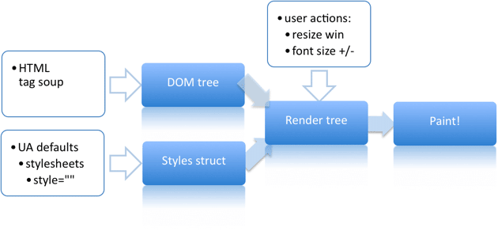

# 网页生成过程

网页生成的步骤分为五步
1. HTML代码转换为DOM树
2. CSS代码转换为CSSOM(CSS object Model)
3. 结合DOM树和CSSOM构造渲染树（包含每个节点的视觉信息）
4. 生成布局，即对渲染树的每个节点进行平面合成（计算位置宽高父子等）
5. 将布局绘制在屏幕上。

## 重排(reflow)和重绘（repaint）

当元素高宽等几何属性改变后，浏览器会重新构造渲染树（3，4），进行重排，重排后将布局绘制到屏幕上，完成重绘。

会引起重排的操作
- 添加或删除DOM元素
- 元素调整宽高
- 元素改变位置
- 获取布局信息(offsetTop,scrollTop等)
- 窗口调整位置

会引起重绘的操作
- 背景颜色，文字颜色改变。

## 减少重排的方案。

- 集中修改样式，替换class而不是一个个修改style
- 采用虚拟DOM，是元素脱离文档流，进行修改后再加入
1. 隐藏元素，应用修改，重新显示。
2. 使用文档片断（docuement fragment）在当前DOM之外构建一个子树，再把它拷贝回文档。
3. 将原始元素拷贝到一个脱离文档的节点中，修改副本，完成后再替换原始元素。或 先将元素从document中删除，完成修改后再把元素放回原来的位置
- 设置position为absolute或fix来脱离文档流。
- DOM的多个读写操作应该放在一起，浏览器会把其变为一个队列处理。